# 1. 서비스 소개

## 서비스 개요

- **진행 기간** : **2022.07.11 ~ 2022.08.19(6주)**
- 한 줄 소개 : 면접 스터디 + AI 면접 분석
- 서비스 명 : **urin**

## 기획 배경

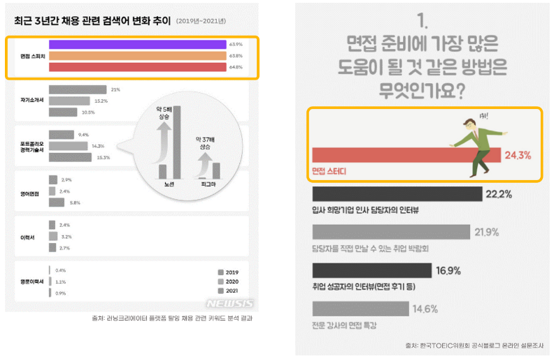

**취업을 준비하는 사람들은 면접 역량을 가장 중요하게 생각한다. 면접 스터디에 대한 관심도 매우 높지만, 스터디를 구할 마땅한 방법이 없다.  따라서 면접 스터디에 대한 높은 수요를 원활하게 해결하고 적절한 면접 스터디를 진행 할 수 있는 면접 스터디 플랫폼을 제공해주는 서비스를 기획하게 되었다.**

 **면접 스터디를 진행할 때 마다 같은 스터디원의 피드백 뿐만 아니라 AI의 피드백을 레포트로 제공 받아 나의 현재 면접 역량을 파악 및 개선할 수 있다.**

## 타겟

1. **면접에 대비하고 싶은 취업 준비생**
2. **면접 전형 탈락의 원인 파악이 힘든 사람**

# 2. 프로젝트 예시

## 서비스 인트로

- 카카오 로그인
- 스터디 제목 & 해시태그 검색


## 면접 스터디 진행 화면

- 화상미팅에 2가지 모드가 존재 (일반, 면접 모드)
- 면접 모드는 면접을 위한 기능이 존재한다. 면접자를 한 명 선택 가능
    - 면접 시작 버튼을 누르면 타이머로 면접 진행 시간 파악 가능
    - 추가로 AI가 면접자의 표정 & 자세를 분석
- 면접 진행하며 평가자 역할을 맡은 사람들은 피드백을 작성 가능


## AI 분석 & 평가자 피드백 Report

- 면접 모드에서 면접자의 표정 & 자세를 AI가 분석한 결과와 평가자들이 작성한 피드백들을 Report에서 한 눈에 볼 수 있다.


# 3. 기획

## ERD


## Figma
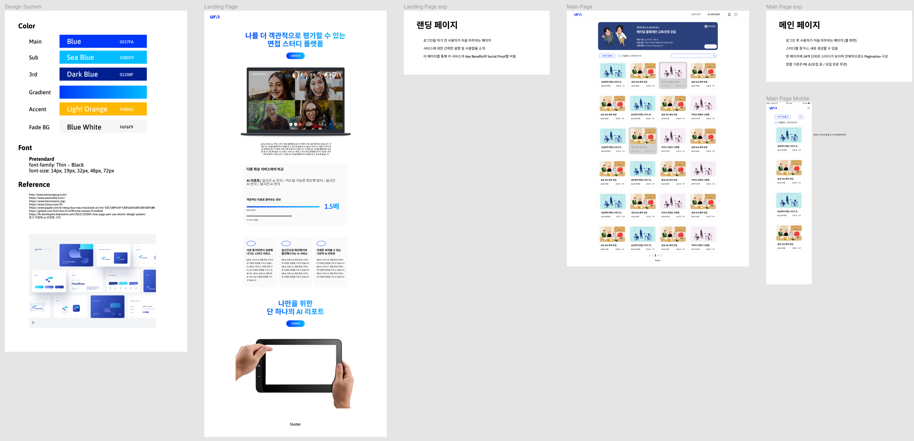
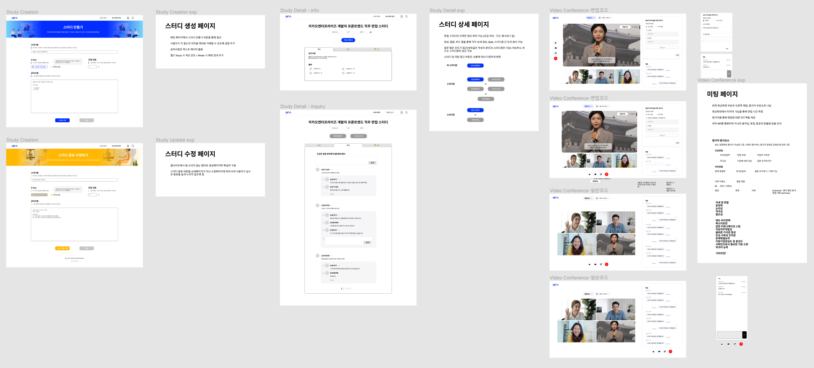
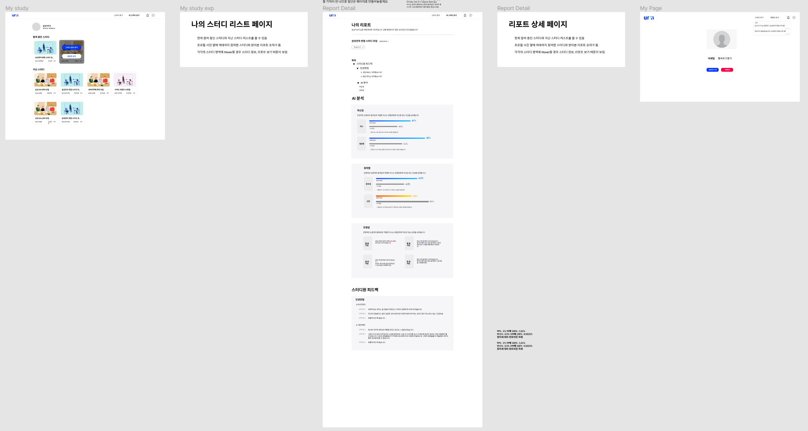

## API 명세


# 4. 기술 스택 및 배포 환경


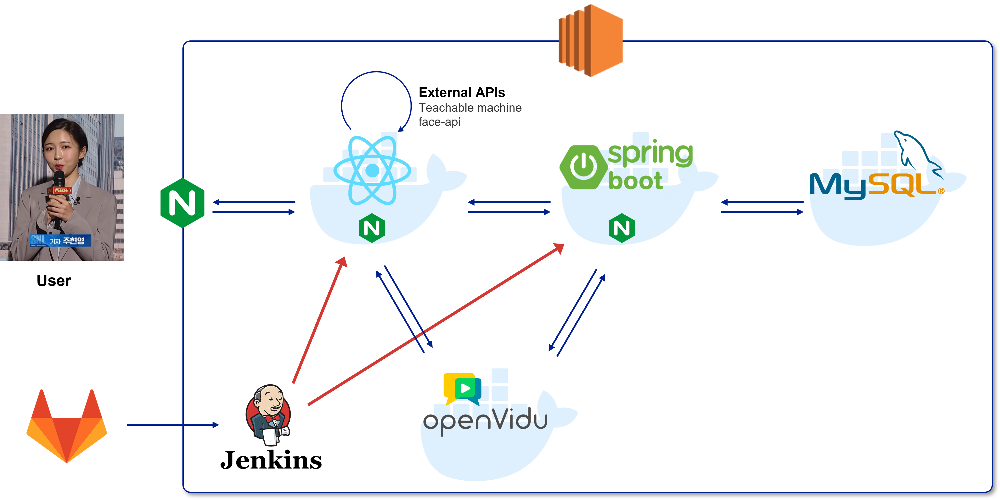

## Frontend


`prettier`와 `eslint`로 코드 스타일 통일(Airbnb style)
`redux`, `reduxjs/toolkit`, `react-router-dom v6`  사용

- OpenVidu </br>
> OpenVidu is a platform to facilitate the addition of video calls in your web or mobile application.
    
    `WebRTC`를 보다 간단하게 적용할 수 있고, 다양한 프레임워크와 호환성이 높은 `openvidu`를 사용하여 프로젝트를 진행했습니다. `openvidu tutorial`의 `openvidu-call-react`의 소스 코드를 기반으로 화상회의를 구현하였습니다
    

- face-api
> JavaScript face recognition API for the browser and nodejs implemented on top of tensorflow.js core

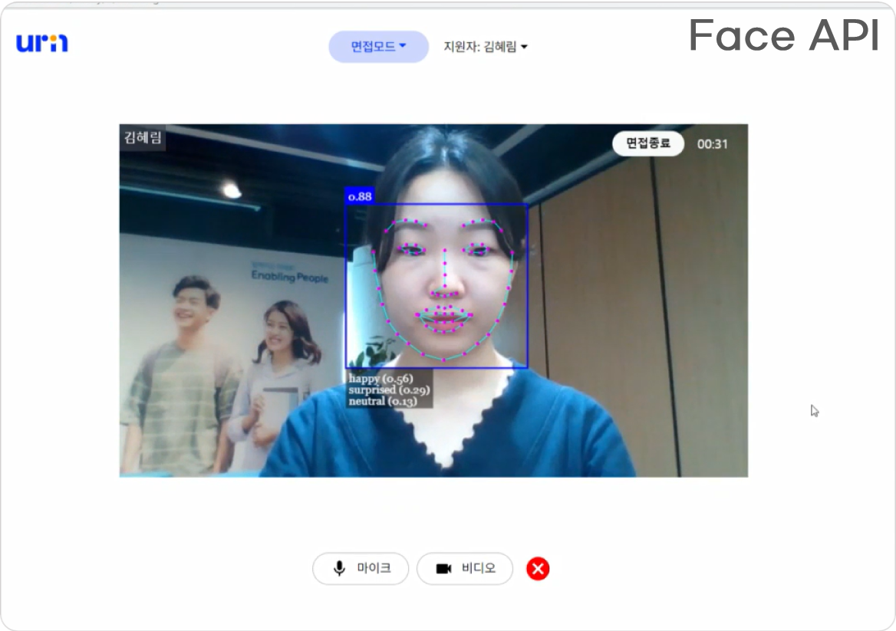
    
    
    `urin` 에서는 `face api`의 다양한 기능 중 `Face Detection` 을 통해 얼굴을 감지하고 `Face Expression Recognition`을 이용해 면접자의 감정을 분석합니다. 
    
- Teachablemachine/pose
> Teachable Machine은 누구나 머신러닝 모델을 쉽고 빠르고 간단하게 만들 수 있도록 제작된 웹 기반 도구입니다.

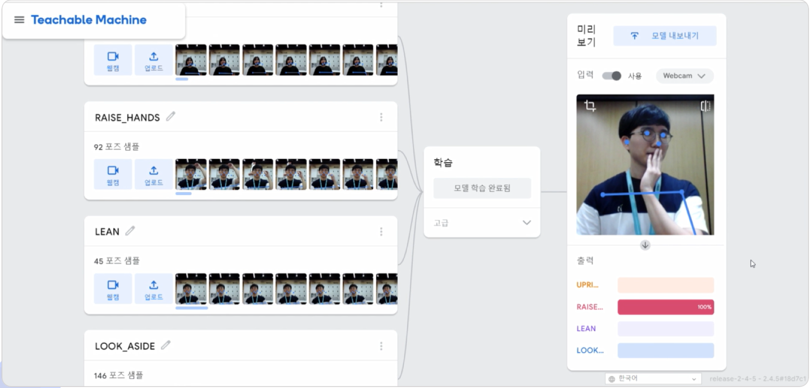

        
    `urin`에서는 `Teachablemachine`의 `pose`라이브러리를 이용해 면접자의 자세를 인식합니다.
    

## Backend


## CI & CD

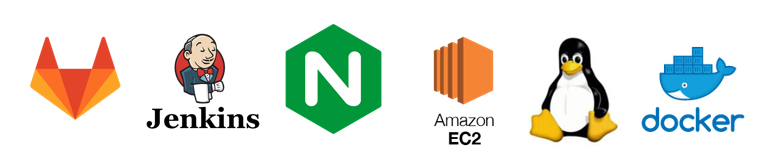

## Version

### Frontend

- NodeJS : 16.16.0
- React : 18.2.0
    - React-redux : 8.0.2
    - React-router-dom : 6.3.0
- face-api.js : 0.22.0
- teachablemachine/pose : 0.8.6

### Backend

- JAVA : JDK 11
- Spring Boot : 2.6.10
- MySQL :  8.0.29

### CI / CD

- Ubuntu : 20.04 LTS
- Docker : 20.10.12
- Nginx : 1.18.0
- Jenkins : 2.346.2

# 5. 프로젝트 진행


## Git Flow

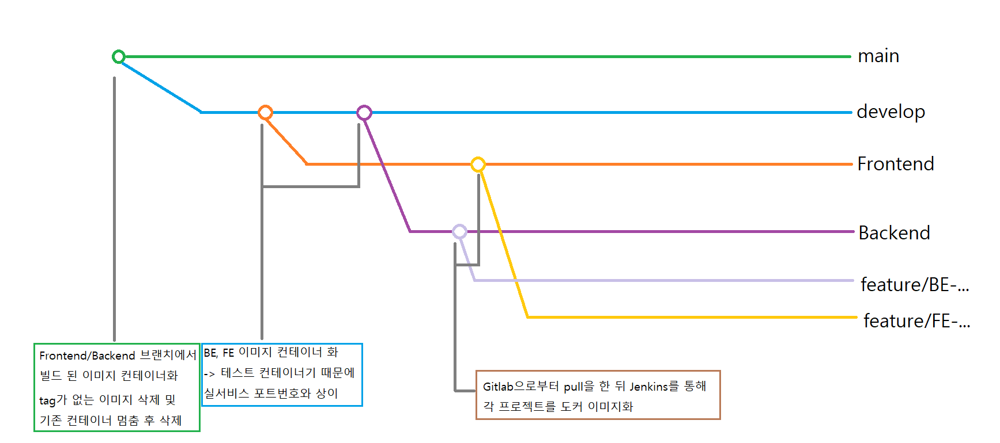

git flow 전략과 github flow 전략 중 git flow 전략을 채택했습니다. `feature`브랜치에서 작업 후`fronend` or `backend`브랜치로 Merge Request를 생성했습니다.

MR은 코드 리뷰를 거쳐 본인이 아닌 사람이 MR을 승인해 주었습니다. `frontend`와 `backend`에 쌓인 commit은 배포할 준비가 되면 `develop`, `main` 브랜치에 반영했습니다.
commit message는 `(gitmoji) <타입> : <제목> <#이슈번호>` 형태로 통일하여 작성했습니다

```java
# (gitmoji) <타입> : <제목> <#이슈번호>

##### 제목은 이슈 번호와 함께 최대 50 글자까지 한 줄로 입력 ############## -> |

# 본문은 위에 작성
######## 본문은 한 줄에 최대 72 글자까지만 입력 ########################### -> |

# --- COMMIT END ---
# <타입> 리스트
#   ✨(:sparkles:) feat   : 기능 (새로운 기능)
#   🐛(:bug:) fix         : 버그 (버그 수정)
#   ♻(:recycle:) refactor : 리팩토링
#   💄(:lipstick:) style   : 스타일 (코드 형식, 세미콜론 추가: 비즈니스 로직에 변경 없음)
#   📝(:memo:) docs        : 문서 (문서 추가, 수정, 삭제)
#   ✅(:white_check_mark:) test : 테스트 (테스트 코드 추가, 수정, 삭제: 비즈니스 로직에 변경 없음)
#   🔨(:hammer:) chore     : 기타 변경사항 (빌드 스크립트 수정 등)
# ------------------
#     제목은 명령문으로
#     제목 끝에 마침표(.) 금지
#     제목과 본문을 한 줄 띄워 분리하기
#     본문은 "어떻게" 보다 "무엇을", "왜"를 설명한다.
#     본문은 한 줄을 작성하고 . 마침표를 찍어서 분리한다.
# ------------------

```

## Jira

- 매 주 월요일, 주간 회의를 통해 한 주 간의 목표를 정하고 Sprint를 생성
- 초반에는 일정에 맞춰 Epic 생성
- JIRA 피드백 이후 핵심 기능 별 Epic생성


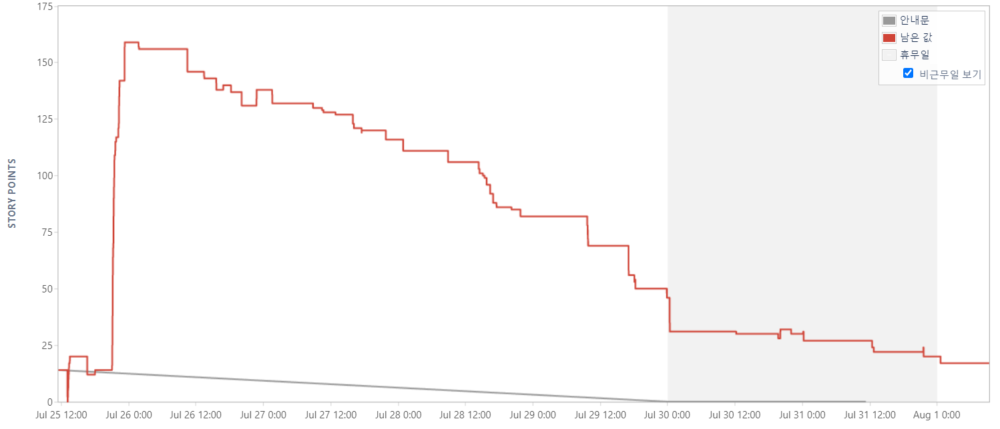

## Notion

### 1) 회의록

- 매일 아침마다 어제 했던 일, 오늘의 계획을 공유하는 Daily Scrum을 진행
- 각 회의 내용을 Tag로 분류한 회의록에 상세히 기록

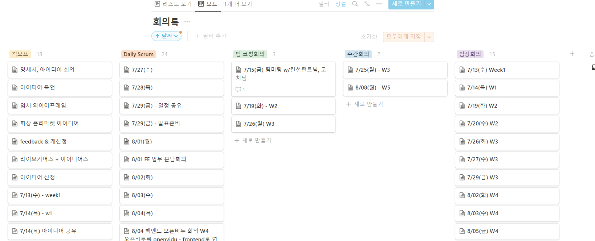

### 2) 자료 공유 (Wiki)

- 중요한 자료를 한 곳에서 관리

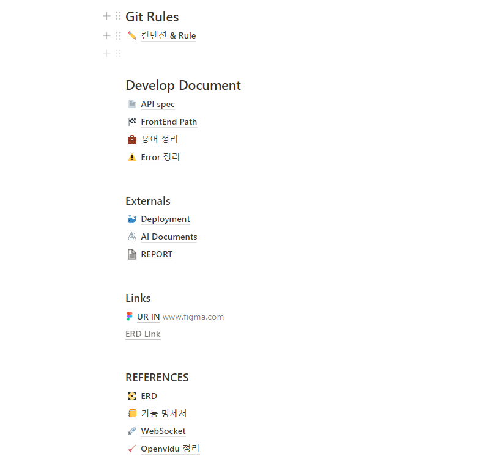

# 6. 타임라인


### **1주차(7/11 ~ 7/15)**

- 아이디어 회의 & 선정

### **2주차(7/18 ~ 7/22)**

- Ver1(서비스 핵심 기능) 기획
- ERD, Wireframe, 기능 정의서 작성

### **3주차(7/25 ~ 7/29)**

- [FE] 컴포넌트 구조도 작성 & HTML 개발
- [BE] CI / CD 구축
- [BE] API 개발

### **4주차(8/1 ~ 8/5)**

- [FE] Redux, Axios
- [BE] 소셜 로그인 & API 예외 처리
- [BE] 서비스 배포

### **5주차(8/8 ~ 8/12)**

- Ver2(서비스 특화 기능) 기획
- [FE] OpenVidu 추가
- [FE] Face-API, Teacherable-Machine 추가
- [BE] Ver2 API 개발 & Ver1 API 유지 보수

### **6주차(8/16 ~ 8/19)**

- Ver2 개발 마무리
- UCC 제작, 발표 준비, 최종 테스트
- 8/19 최종발표

# 7. 소감 및 배운 점

## 1. 팀원 소개
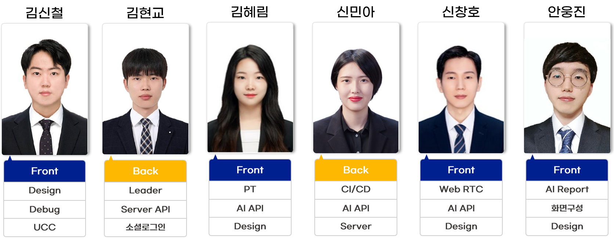

## 2. 소감

### 김신철
서비스 내 다양한 곳에서 백엔드, 프론트엔드와의 협업을 배울 수 있어서 유익했습니다. 처음에는 협업이 익숙하지 않아 이것저것 문제가 생길 때마다 바로 물어보곤 했습니다. 하지만 점차 프로젝트를 진행하면서 API 명세서나 에러 상황 정리 등을 먼저 확인하면서 서로의 업무부담을 줄여 효율적으로 업무를 할 수 있었습니다.</br>
또한 실제로 서비스를 배포까지 해보면서 내가 마주한 지금 오류가 프론트와 백 코드인지, 아니면 서버 구동의 문제인지 등을 스스로 찾아나가면서 각 부분을 맡은 동료들과 소통하는 법을 배울 수 있었습니다.</br>
 후반부에 에러 디버깅을 맡아 팀원들이 이미 구현된 코드를 수정하는 일을 맡았는데, 이 과정에서 통일된 스타일 가이드가 부재했다는 점은 아쉬움으로 남습니다. 물론, 프로젝트를 시작하면서 이야기를 나눴던 부분은 있었지만, 프로젝트를 진행하다보니 생각보다 놓친 부분들이 꽤 있다는 것을 발견했습니다. 그럼에도 리액트를 모두 처음 사용해보는 팀원들과 협업하면서 큰 오류와 충돌 없이 프로젝트를 잘 마무리할 수 있어서 기쁩니다.</br>
 두번째로 남는 아쉬움은 자바스크립트와 리액트에 대한 이해도입니다. 에러 상황을 고쳐나가면서 제가 짠 코드들이 정말 자바스크립트스럽고 리액트스러웠는가 의문을 품게 되었습니다. 비동기적 특성을, 컴포넌트 단위의 특성을 잘 살리지 못한 부분이 있어 아쉬움이 남습니다. 처음 코드를 짤 때에는 이것이 시간을 아끼는 것이라 생각하고 구현이 되는 데에 초점을 두었습니다. 그러나 막상 오류가 발생할 경우에는 시간이 걸리더라도, 컴포넌트 단위 별로 쪼개고 적재적소에 비동기를 활용하는 것이 중요하다고 느꼈습니다. </br>
 이번 프로젝트를 시작하면서 기획했던 모든 것들을 구현할 수 있어서 만족스러운 프로젝트였습니다. 더 나아가 단순히 구현하는 데에 그치지 않고, 어떻게 하면 사용자에게 더 좋은 UX를 제공할 수 있을지 고민하면서 코드를 짤 수 있어서 유익했습니다.

### 김현교
개인적으로 JPA나 Spring boot등 강의를 들으며 학습했던 기술들을 활용하며 체득할 수 있었습니다. JPA 영속성 컨텍스트 문제, Fetch Join 중복 문제 등 강의를 수동적으로 들을 때는 생각할 수 없었던 것들을 해결해나가면서 기술에 대한 이해와 숙련도를 높일 수 있었습니다. 또한, 소셜 로그인을 구현하며 복잡한 Spring Security를 이해하는 것이 힘들었지만, 공식문서, 유튜브, 블로그 등 여러 매체들로 부딪히며 결국 구현해냈고, 모르는 것을 학습할 때 필요한 인내심을 배웠습니다.  </br>
그리고 처음으로 서비스 배포 환경을 경험했고, 테스트 코드나 로깅이 굉장히 중요한 요소라는 것을 깨닫게 되었습니다. 다음 프로젝트에서는 배포 환경에서 다양한 로그 레벨을 설정하여 디버깅을 할 수 있도록 하고, 각각의 기능에 단위 테스트를 튼튼하게 만들어서 코드에 대한 확신을 바탕으로 빠른 오류 해결을 하면 좋을 것 같습니다.</br>

팀적으로는 프론트 & 백엔드를 나눠서 개발해 본 것이 좋았습니다. 평소 협업을 잘 하는 방법에 대한 궁금증이 있었는데 이번 프로젝트를 진행하며 상대의 요구사항을 이해하기 위한 소통 방법, 소통의 결과물을 API 명세서에 상세히 기록하여 커뮤니케이션 비용을 줄이는 방법 등 협업 스킬을 배울 수 있었습니다.</br>
마지막으로, 프로젝트 팀장을 맡으면서 회의를 잘 주도하는 방법에 대한 고민과 시도를 다양하게 해보면서 어느 정도 그 해답을 찾은 것 같아서 좋았습니다.</br>
팀원 모두가 특장점이 달랐고, 각자가 제 역할을 너무 잘 해주어서 6주 내내 수월하게 프로젝트를 진행할 수 있었던 것 같습니다. 이런 다재다능한 분들의 팀장을 맡을 수 있었다는 게 가장 만족스러운 부분이었습니다. 다들 고생 많으셨습니다!!


### 김혜림
개발자로 진로를 전환하고 처음으로 규모있는 (비교적) 장기 프로젝트를 진행해보았습니다. 팀으로써의 시너지를 기대하기 보다는 제 자신이 1인분을 해낼 수 있을지에 대해서 더 걱정이 많았던 것 같은데, 저희가 바라던 형태로 프로젝트를 마무리 할 수 있게 되어서 정말 뿌듯합니다:) </br>
사실 공통프로젝트는 저에게 매 순간이 도전이었습니다. 팀을 만들어가고, 원하는 서비스를 기획하고, 새로운 프레임워크에 대해서 공부하고, 실제 개발하는 것까지 어느 것 하나 쉽게 넘어갔던 것이 없다고 생각합니다. 하나하나 달성해 나가고 어려움을 극복할 때마다 느겼떤 짧고 굵은 희열은 나중에도 계속 기억에 남을 것 같아요. 그렇기 때문에 저희가 원하던 목표를 이룬 이 프로젝트 결과물이 더욱 뿌듯하게 느껴지는 것 같습니다. </br>
지난번에 팀원들에게 말했듯, 저희 팀은 각자 한명 한명의 장점이 명확한 팀이었습니다. 그리고 그 분명히 구분된 장점이 서로를 보완하고 때론 시너지를 발휘해 각자 1.3인분씩은 든든하게 맡아줬던 것이라 생각합니다. 공통 프로젝트에서 진정한 협업이란 무엇인지를 배울 수 있어 너무나 뜻깊고 때론 감동적인 순간들이었습니다. 매 단계에서 효율적으로 소통하고 맡은 바 최선을 넘어 최고의 결과물을 만들어준 팀원들에게 진심으로 감사하다는 말씀 전하고 싶습니다. 4팀 모두 감사합니다!

### 신민아
이번 프로젝트를 통해 많은 신기술과 도구를 활용한 것 같습니다. CI/CD를 구축하며 평소에 관심있었던 ```Docker```를 직접 사용해보며 각각의 컴포넌트를 컨테이너화 하여 관리하는 방법, Docker의 명령어와 Dockerfile 작성법 등에 대한 기본적인 사용법 및 Docker에 대한 기초적인 지식을 배울 수 있어서 좋은 경험이었습니다. 또한, ```Jenkins```도 도입하여 Frontend와 Backend 개발 시 자동으로 무중단 배포에 가깝게 구축하여 배포 환경에서의 테스트에 대한 스트레스를 줄일 수 있어 뿌듯했습니다.</br>
 이 외에도 전반적인 서버 관리를 도맡아서 ```Ubuntu``` 사용법을 배우고 ```Nginx```를 사용하며 ```SSL``` 적용도 해보며 조금 더 현업에서 사용하는 ```DevOps```와 가까워 진 것 같아 좋았습니다.</br>
  그리고 평소에 사용해 보지 못한 Spring Boot 관련 기술인 ```JPA```를 활용하여 효율적으로 DB 관련 리소스를 관리할 수 있어 효율적으로 개발할 수 있었던 것 같습니다. 그리고, 활발한 ```Code Review```를 통해 놓쳤던 버그를 찾아서 오류를 미연에 방지했던 경험과, ```Spring Security```와 ```QueryDsl``` 등 여러 기술을 간접적으로 체험해 볼 수 있다는 점이 기억에 남습니다!</br>
   프로젝트를 진행하며 ```Jira```, ```Notion```을 통해 체계적으로 프로젝트의 일감 관리를 할 수 있어 좋았으나, 생각보다 버그와 싸우는 시간이 길어서 시간 분배 등을 정확하게 하지 못한 점이 아쉬웠습니다.</br>
    마지막으로, 열정적이고 도전적이며 능력치가 좋은 팀원들을 만나 해결되지 않는 문제가 생겼을 때도 십시일반 도와주셔서 빨리 해결한 적도 많고 탄탄한 팀워크를 바탕으로 UR IN이라는 면접 서비스 개발을 순조롭게 마무리 할 수 있었던 것 같습니다! 마지막까지 고생 많이한 ```동률 없는 동률팀``` 팀원들께 감사합니다!

### 신창호
이번 프로젝트를 시작하면서 6주라는 짧은 기간동안 하기에는 조금 많은 목표를 세웠는데 팀원들이 각자의 역할을 훌륭하게 수행해 주셔서 이렇게 좋은 결과물을 낼 수 있었습니다. 각자 가지고 있는 능력이 달랐기 때문에 유기적으로 업무를 수행해 최고의 효율을 뽑아낼 수 있었던 것 같습니다.</br>
 또 React, OpenVidu, teachablemachine, face-api에 이르기까지 새로운 것들에 많이 도전했는데 때론 큰 난관에 부딪혀 힘들기도 했지만 끝까지 최선을 다해 문제를 해결할 수 있었고 그만큼 성장하지 않았나 싶습니다. 마지막으로 함께 고생해준 팀원들, 정말 신뢰할 수 있는 팀원들이었고 같이 협업할 수 있어서 정말 좋았습니다! 모두 수고하셨습니다~

### 안웅진
이번 프로젝트에 중간에 합류하게되어 이래저래 부족한부분도 많았지만 좋은 팀원분들이 있어 많이 배우는 시간이 되었습니다. 프론트에서 react를 하게되어 처음이었지만 새로운 기술을 배우고 결과를 낼 수 있어서 좋은 경험이 되었습니다. 이번에 배운 협력경험과 기술을 가지고 팀원분들 다 잘되셨으면 좋겠습니다. 부족한 사람과 잘 이끌어주신 팀원분들 감사합니다!!
