## [페이지 소개]
- 역할
  - 1번 참가자 - 신창호

1. **Intro 스크롤 내리기**
   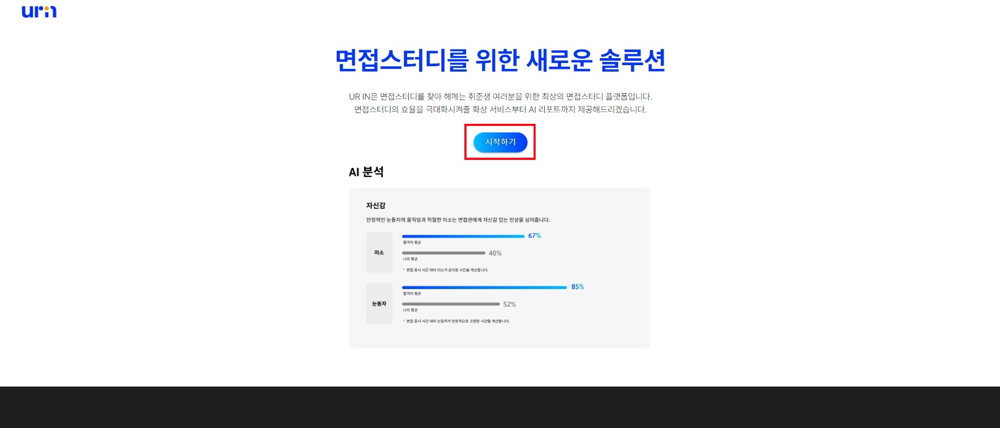
2. **카카오로 소셜 로그인**
3. **스터디 검색 (제목, 해시태그)**
   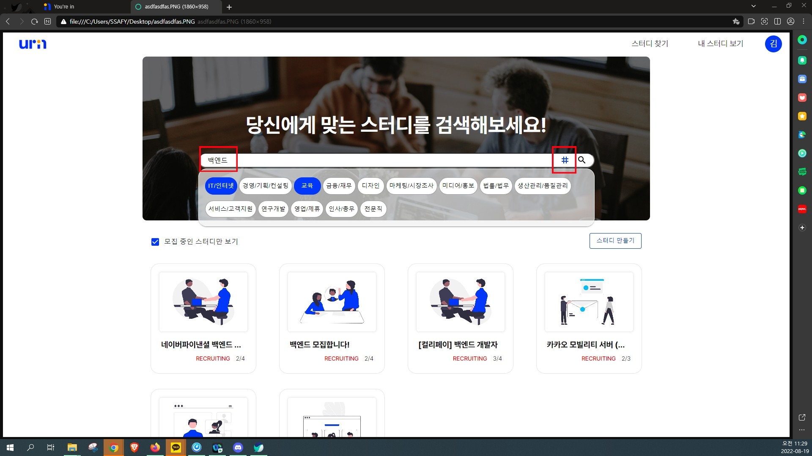
4. **스터디 상세페이지**
   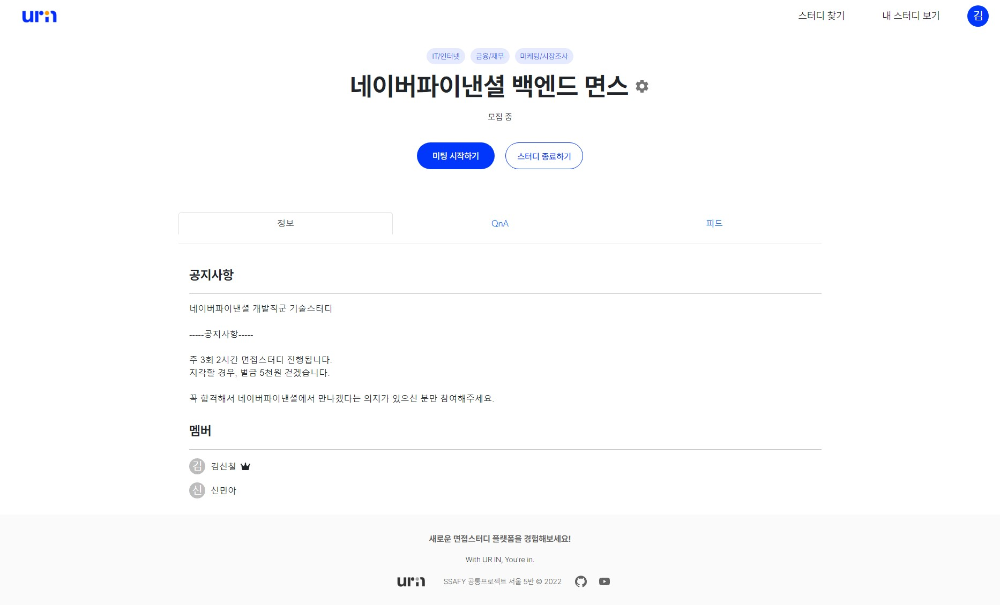
5. **QNA 보여주기**
   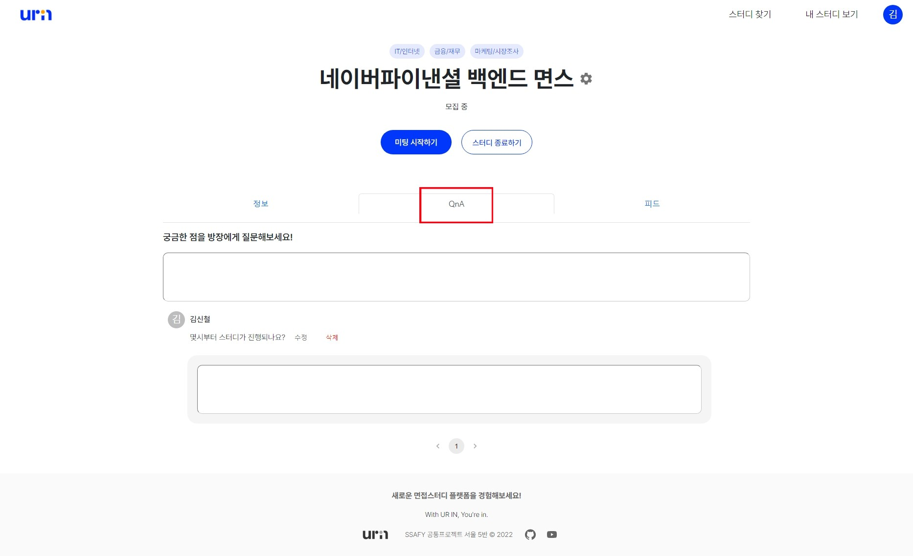
6. **피드가 잠겨있는 모습**
   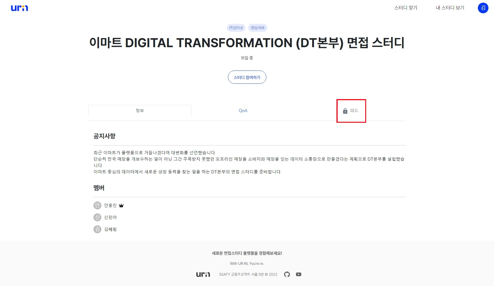
7. **스터디 참여하고 피드를 볼 수 있는 모습**
   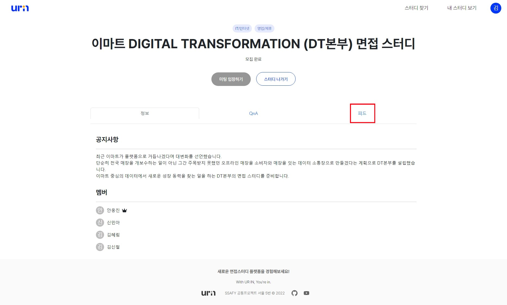

## [미팅 모드 순서]

- 역할
  - 방장 - 김신철
  - 2번 참가자 - 신민아

1. **일반모드 -> 면접모드 전환**
   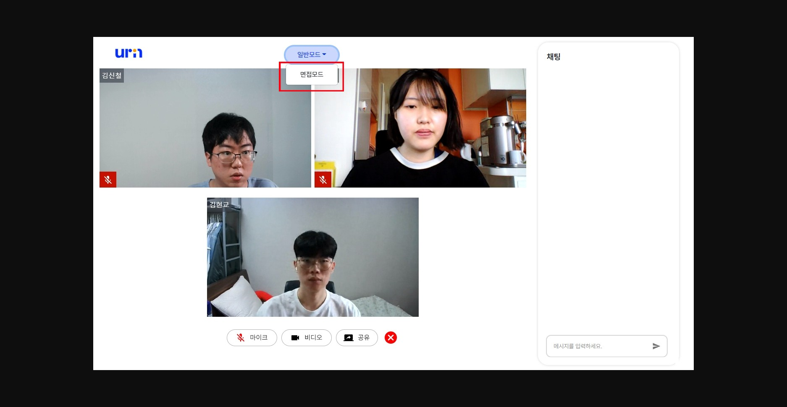
2. **면접자 면접 시작**
   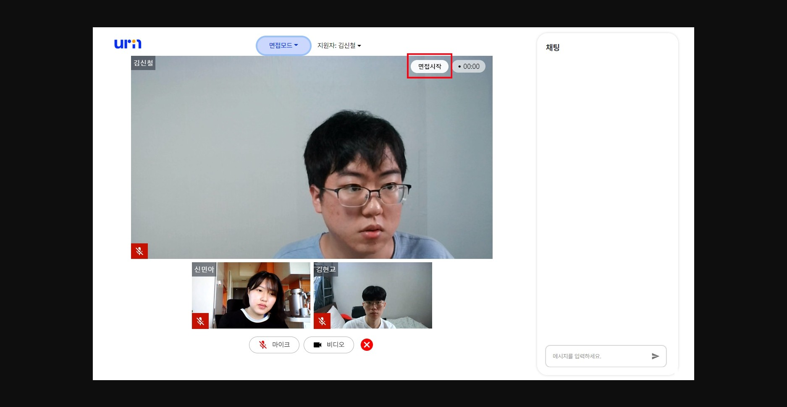
3. **면접관이 피드백을 적고 저장.**
   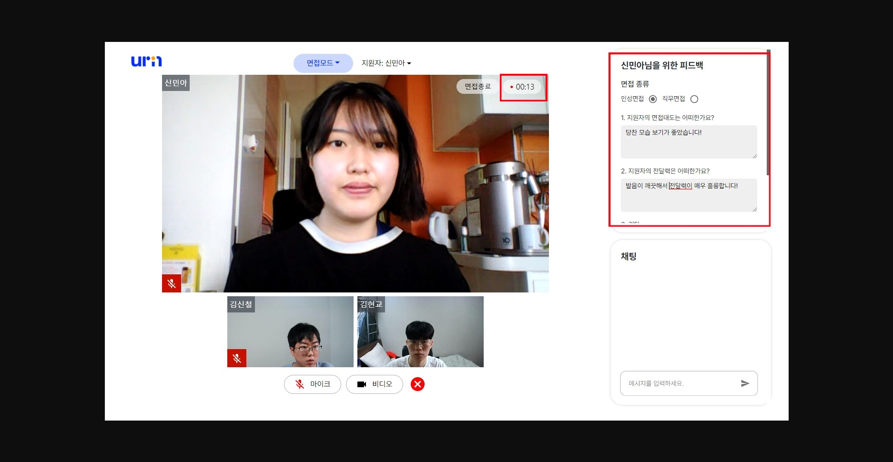
4. **면접 모드 종료**
5. **면접 나가기**
   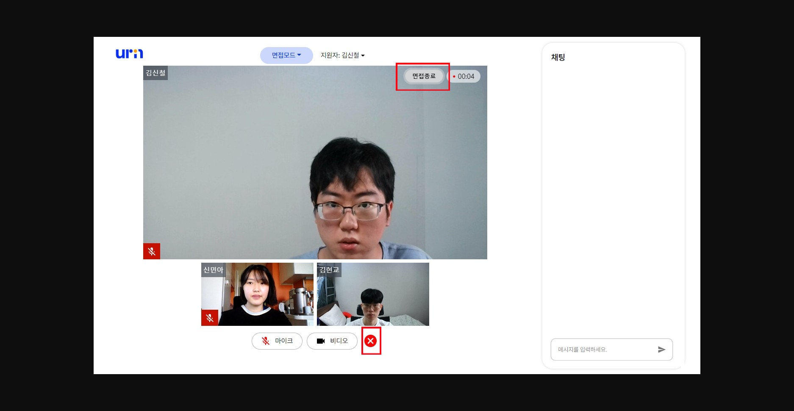
6. **내 스터디에서 방금 스터디의 레포트 확인**
   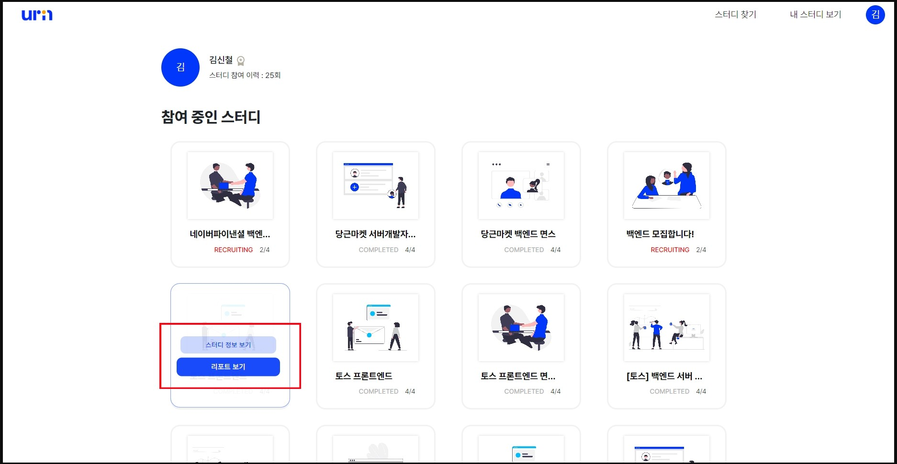
7. **레포트 보여주고 PDF로 내보내기**
   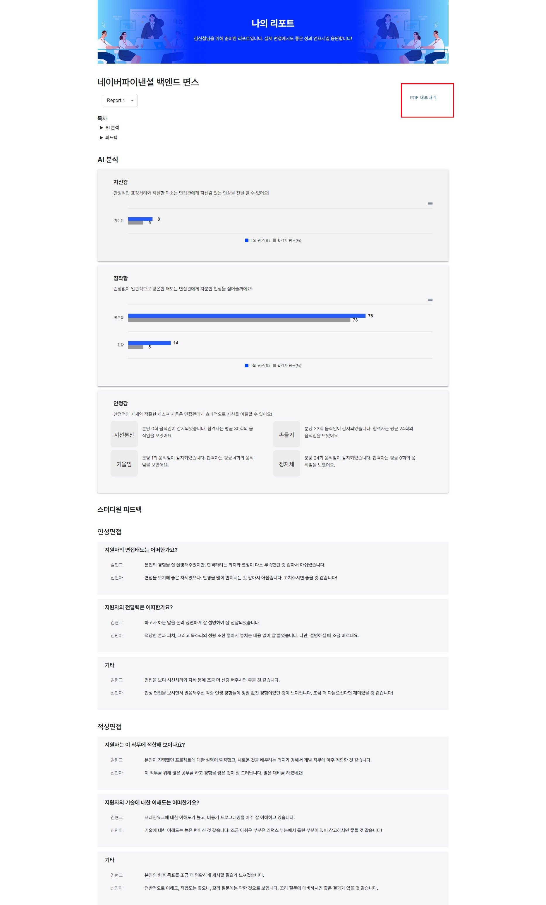